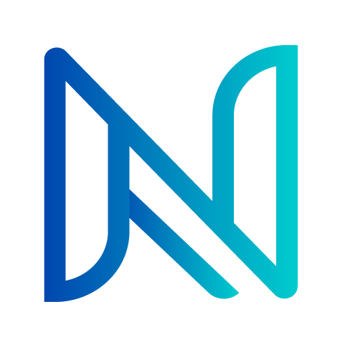

<div align="center">
  
</div>

<div align="center">

# 🚀 Hi there, **I'm Naveen Prasath**


<div>
  
  
  
  
</div>

<br/>

📍 **Coimbatore, Tamil Nadu, India** | 🎓 **B.Tech in AI & Data Science**  
🏛️ **Kathir College of Engineering** | 📧 **naveenprasath144@gmail.com**

---

</div>

## 🎯 **About Me**


```javascript
const Naveen = {
    name: "Naveen Prasath P",
    role: ["Graphic Designer", "UI/UX Designer", "Video Editor", "Brand Strategist"],
    education: "B.Tech in AI & Data Science",
    location: "Coimbatore, Tamil Nadu, India",

    currentlyLearning: ["Machine Learning", "Deep Learning", "UI/UX Design"],
    passions: ["Graphic Design", "Video Editing", "Logo Design", "AI/ML"],

    languages: ["Tamil", "English", "Malayalam"],

    lifePhilosophy: "Reshaping human perception through innovative design ✨"
};

console.log(Naveen);
```

---

## 💼 **Professional Journey**

### 🎬 Video Editor | Junior Manager — Hii Medias
📅 *Oct 2025 – Dec 2025*

- 🎞️ Delivered high-quality visual content through efficient post-production and impactful storytelling
- 🗂️ Coordinated team timelines and ensured on-time project delivery as Junior Manager

---

### 🎨 Graphic Designer | Development — Bhogan Mediasoft
📅 *Jan 2025 – May 2025*

- 🎯 Developed compelling visuals and brand elements to convey messages effectively
- 🚀 Enhanced UX/UI designs and marketing materials across various media platforms

---

### 🤝 Professional Service Director — Rotaract Club of Coimbatore Royals
📅 *Jun 2024 – Jul 2025*

- 📊 Strategically managed Professional Service Projects
- 📝 Maintained comprehensive project documentation and records
- 🤝 Coordinated team activities and led community service initiatives

---

### 📸 Photography Club Co-Ordinator — Adept Association, Kathir College of Engineering
📅 *Jun 2023 – Jun 2024*

- 🎓 Led photography workshops covering various techniques and styles
- 🖼️ Organized photo exhibitions and advanced knowledge-sharing sessions
- 🧭 Guided peers in exploring photography careers and visual arts

---

## 🚀 **Tech Stack & Tools**

<div style="padding: 20px; font-family: Arial, sans-serif;">

  <!-- 🎨 Graphic Designing -->
  <h2>🎨 Graphic Designing</h2>
  <p style="color:#FFFFFF;">Crafting visually striking designs using industry-standard tools for digital and motion design.</p>
  <table style="width: 50%; table-layout: fixed;">
    <tr align="left" style="color: white;">
      <th>Photoshop</th>
      <th>Illustrator</th>
      <th>Figma</th>
      <th>Canva</th>
      <th>After Effects</th>
      <th>CapCut</th>
    </tr>
    <tr align="left">
      <td></td>
      <td></td>
      <td></td>
      <td></td>
      <td></td>
      <td></td>
    </tr>
  </table>

  <br/>

  <!-- 💻 Frontend Development -->
  <h2>💻 Frontend Development</h2>
  <p style="color:#FFFFFF;">Building responsive and dynamic web interfaces with modern technologies.</p>
  <table style="width: 50%; table-layout: fixed;">
    <tr align="left" style="color: white;">
      <th>HTML5</th>
      <th>CSS3</th>
      <th>JavaScript</th>
      <th>ReactJS</th>
      <th>React Native</th>
    </tr>
    <tr align="left">
      <td></td>
      <td></td>
      <td></td>
      <td></td>
      <td></td>
    </tr>
  </table>

  <br/>

  <!-- 🌐 Backend Development -->
  <h2>🌐 Backend Development</h2>
  <p style="color:#FFFFFF;">Writing server-side logic to build scalable APIs and backend services.</p>
  <table style="width: 50%; table-layout: fixed;">
    <tr align="left" style="color: white;">
      <th>NodeJS</th>
      <th>Flask</th>
    </tr>
    <tr align="left">
      <td></td>
      <td></td>
    </tr>
  </table>

  <br/>

  <!-- 🧠 AI & Data Science -->
  <h2>🧠 AI & Data Science</h2>
  <p style="color:#FFFFFF;">Applying machine learning and deep learning techniques to generate actionable insights.</p>
  <table style="width: 50%; table-layout: auto;">
    <tr align="left" style="color: white;">
      <th>TensorFlow</th>
      <th>Keras</th>
      <th>NumPy</th>
      <th>Pandas</th>
      <th>Matplotlib</th>
      <th>MySQL</th>
    </tr>
    <tr align="left">
      <td></td>
      <td></td>
      <td></td>
      <td></td>
      <td></td>
      <td></td>
    </tr>
  </table>

</div>

---

## 🏅 **Certifications**

| Certificate | Issuer |
|---|---|
| 🎓 Software Engineer Trainee | IZET-E Internship |
| 🍃 Introduction to MongoDB | MongoDB.com |
| 🤖 Deep Learning with Python | Great Learning |
| 🌐 Web Development | Teachnook Internship |

---

## 🌐 **Languages**


---

## 📬 **Let's Connect & Collaborate**

Have an idea, collaboration, or just want to say hi? I'm always open to meaningful conversations and exciting opportunities.

📧 Email me: **naveenprasath144@gmail.com**  
📞 Call me: **+91 9994544211**  
💼 Connect on [**LinkedIn**](https://www.linkedin.com/in/naveen-prasath144)  
👨‍💻 Check out my code on [**GitHub**](https://github.com/NaveenKitty14)  
🌐 Explore my portfolio: [**Live Website**](https://naveenkitty14.github.io/Naveen-Prasath-mind/)

> ✨ *Driven by curiosity and passion, I aim to turn innovative ideas into digital reality. Let's create something impactful together.* 🚀

---

## 📈 **Contribution Graph**

<div align="center">
  <table>
    <tr>
      <td style="border: none;" align="center">
        
      </td>
      <td style="border: none;" align="center">
        
      </td>
    </tr>
  </table>
</div>

<div align="center">
  
</div>
